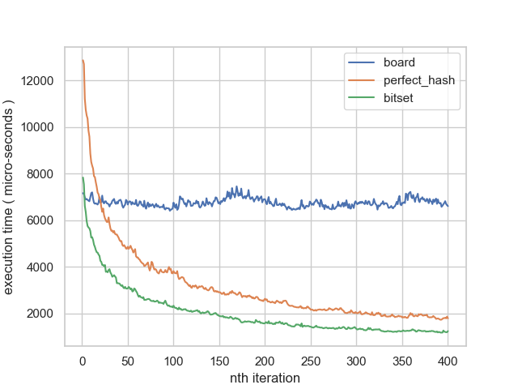

# Game of Life

Simulates Cellular Automata, including Conway's Game of Life, in various formats.

## Tests

To build the tests:

```
build.bat --test
```
And run with:

```
ca_test
```

## Profiling 

To run the performance profiles, build with:

```
build.bat --profile
```
And run with:

```
ca_profile
```
## Compilation

C++23 is required. The code compiles on GCC 13.2.0.

Dependencies:
- boost test
- Kokkos mdspan
- raylib

Compiling with GCC 13.2.0 gives no warnings.

## Cube


## Optimization

### Using std::bitset to speed-up evolution

During the evolve stage, we count how many live cells there are in a nine-cell region. We then use this count to detemine the state of the central cell in this region in the next evolution. 
If the live-cell count is zero, we know that this cell has no possiblilty of changing in the next generation, so we don't need to check it. We can maintain a bitset of active cells
that keeps track of which cells have a non-zero count and only check these cells in the next generation. 

In the first evolution every cell needs to be checked:

```cpp
std::bitset<GRID_WIDTH * GRID_HEIGHT> active_cells;

active_cells.set();             // set every bit to '1'
```
Edge-cells are padding, so we need to remove them from active_cells. To do this we define a bit-mask called edge_mask:

```cpp
std::bitset<GRID_WIDTH * GRID_HEIGHT> edge_mask;

// set every bit in the edge-mask to '1'
edge_mask.set();

// clear each edge-cell
for ( j = 0; j < GRID_WIDTH; ++j ) {

  edge_mask.reset( j );                                      // zero-out the top row
  edge_mask.reset( ( GRID_HEIGHT - 1 ) * GRID_WIDTH + j );   // zero-out bottom row
}

for ( i = 0; i < GRID_HEIGHT; ++ i ) {

  edge_mask.reset( i * GRID_WIDTH );                         // zero-out left column
  edge_mask.reset( i * GRID_WIDTH + ( GRID_WIDTH - 1 ) );    // zero-out right column
}
```

Now we can do a bitwise AND between active_cells and edge_mask to remove the padding:

```cpp
active_cells &= edge_cells
```

<p align="center">
  
</p>

Now we need two more bitsets:

( 1 ) Activated cells: keeps track of all the dead cells that become live and and their neighbors so they can be added to active_cells.

( 2 ) Deactivated cells: keeps track of any active cells that have a zero live cells in their region. 

```cpp
std::bitset<GRID_WIDTH * GRID_HEIGHT> activated_cells;
std::bitset<GRID_WIDTH * GRID_HEIGHT> deactivated_cells;
```
In the case that cell 3 and cell 7 transition from dead to live, they and their neighbors are added to activated_cells. Activated cells are then added to active_cells using a bitwise OR:

```cpp
active_cells |= activated_cells
```
<p align="center">
  
</p>

In the case that cell 9 dies it is added to deactivated_cells. Deactivated cells are then removed from active_cells using a bitwise XOR:

```cpp
active_cells ^= deactivated_cells
```
<p align="center">
  
</p>

Finally, any padding cells that were added as neighbors of activated cells need to be removed using the edge_mask:

```cpp
active_cells &= edge_mask
```
<p align="center">
  
</p>

Now we only need to check eight cells in the next iteration instead of all nine. In reality, most cells on the gird will be inactive, so speed-up will be significant.

<p align="center">
  
</p>

